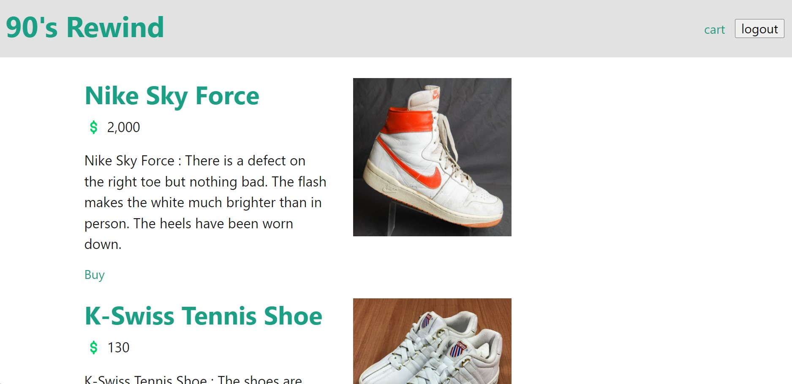

# 90s Rewind

## Project 2 - Team 1

This application creates a place for fans of 90s footwear to find hard-to-find throwback shoes.

## Mock-up

## Installation

This application requires installation of npm (incl. nodemon, bcrypt, dotenv, express, mysql2, sequelize, express-handlebars), MySQL, and Heroku. 

The deployed application can be found here: https://group-project-90s-rewind.herokuapp.com/

All elements of the project can be examined here: https://github.com/shanehancock64/GroupProject2 

## Credits

Referenced documentation and tutorials:

Helpers | Handlebars: https://handlebarsjs.com/guide/expressions.html#helpers

Associations - One to Many | https://sequelize.org/docs/v6/core-concepts/assocs/#one-to-many-relationships

Deploy with Heroku and MySQL: https://coding-boot-camp.github.io/full-stack/heroku/deploy-with-heroku-and-mysql

Additional assistance:

Thank you to our instructional staff Farish and Riley!

## Features

90's Rewind uses Node.js and Express.js to create a RESTful API, with established GET, POST, and DELETE routes.

The app's database uses MySQL and Sequelize, the pages use Handlebars.js as the template engine, and the app is deployed on Heroku.

90's Rewind has a folder structure that meets the Model-View-Controller paradigm, uses npm express-session and cookies to authenticate logged-in users, and protects key API keys and other sensitive information with environment variables. 

The app uses , a technology not discussed in the boot camp.  

90's Rewind has polished, responsive UI, and accepts and responds to user input.

The app meets good-quality coding standards, and is accompanied by this professional README.

## Team Members

Leah Bredemeyer, Matt Estes, Shane Hancock, Cole Hubert